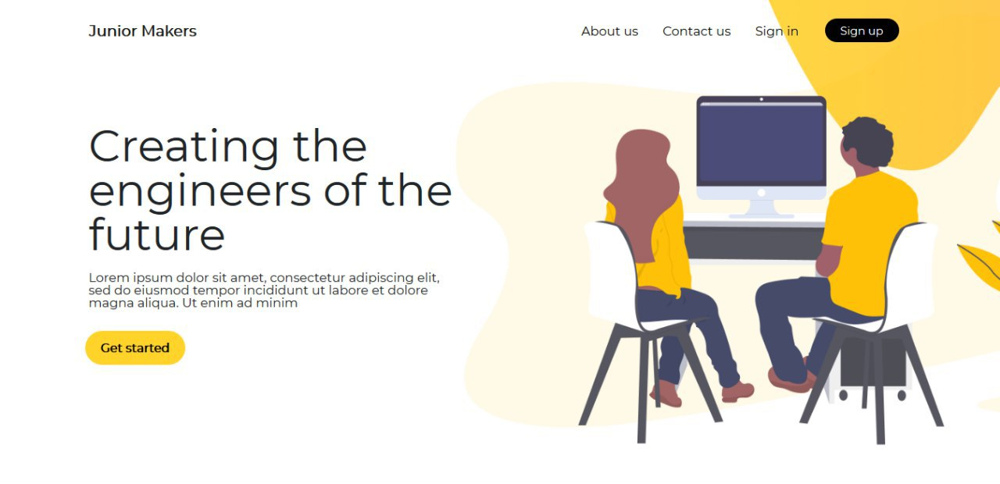

# Junior Makers Program Website

This Website is an E-learning platform developed for junior makers program.


---
## Developers:
The platform is developed by:
- AZZAZ RAHMANI OUSSAMA
- GUITT BAHIA
- MERZOUG FATIMA
- NAAS MOHAMED
- TAGUIOUINE MOUNIR
- TASFAOUT ABDERRAHIM

## Requirements:

For development, you will need Node.js, redis server, a node global package and postgres installed in your environement.

## Installation:
First of all, get the source code of the project by running the command:  
```bash
$ git clone https://github.com/ossamaazzaz/JMP.git
```

Then navigate to the project's directory:
```bash
$ cd JMP
```

Install the modules listed as dependencies by running: 
```bash
$ npm install
``` 

## APIs keys:
Enter the `/config/keys.js` file and put your API keys there in order to test all the functionalities.

## Running the server:
Create a copy of the `.env.example` file and name it `.env` 
```bash
$ cp .env.example .env
```

Open the `.env` file and change the environment variables based on your configuration.

Run redis server by:
```bash
$ redis-server
```

Run the server by:
```bash
$ npm start
```

    
The server listens to requests on port `3000`.

Enter [localhost:3000](http://localhost:3000/) on your browser to open the project.
